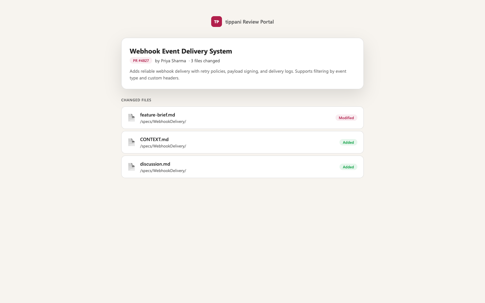
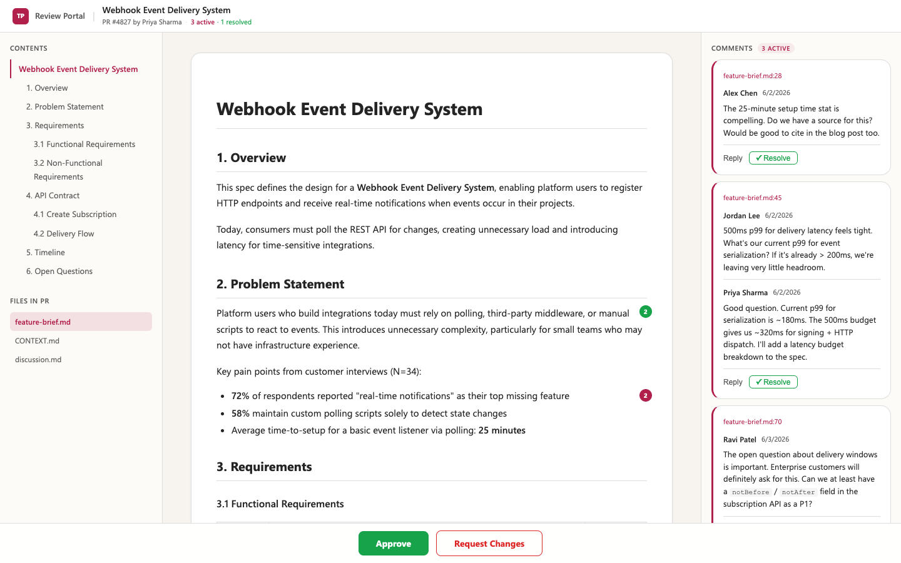

# tippani

> टिप्पणी — *annotation* (Sanskrit)

Offline-capable CLI that renders Azure DevOps PR markdown files as a clean, three-column review portal — designed for non-technical reviewers who shouldn't need to learn ADO's diff view.

## Quick Start

Install globally from npm:

```bash
npm install -g tippani
tippani 12345 --org=https://dev.azure.com/YOUR_ORG --project="Your Project" --save-config
```

Or run without installing:

```bash
npx tippani 12345 --org=https://dev.azure.com/YOUR_ORG --project="Your Project" --save-config
```

Or download a standalone binary from the [latest release](https://github.com/mavaali/tippani/releases/latest):

| Platform | Download | Requires |
|---|---|---|
| **macOS** (Apple Silicon) | [`tippani`](https://github.com/mavaali/tippani/releases/latest/download/tippani) | Nothing — standalone binary |
| **Windows** | [`cli.cjs`](https://github.com/mavaali/tippani/releases/latest/download/cli.cjs) + [`tippani.bat`](https://github.com/mavaali/tippani/releases/latest/download/tippani.bat) | Node.js 18+ |
| **Linux / macOS** | [`cli.cjs`](https://github.com/mavaali/tippani/releases/latest/download/cli.cjs) + [`tippani.sh`](https://github.com/mavaali/tippani/releases/latest/download/tippani.sh) | Node.js 18+ |

## Screenshots

**File Picker** — select which file to review from a multi-file PR:



**Spec View** — three-column layout with TOC, rendered markdown, and comment threads:



## Features

- **File picker** — multi-file PRs show a landing page; single-file PRs auto-open
- **Three-column layout** — TOC sidebar, rendered spec, comment threads (all resizable)
- **Inline commenting** — hover any content block → click `+` → comment posts to ADO
- **Offline mode** — cache PR data, comment offline, sync when reconnected
- **Dark mode** — auto-detects system preference
- **Active/resolved threads** — color-coded with inline bubbles on spec content
- **Review actions** — Approve / Request Changes from the bottom bar

## Usage

```bash
# Open a PR for review (uses saved config)
npx tippani <PR_ID>

# Open a specific file directly
npx tippani <PR_ID> --file="/path/to/spec.md"

# Work offline (must have run online at least once for this PR)
npx tippani <PR_ID> --offline

# Force re-fetch from ADO
npx tippani <PR_ID> --refresh
```

## Configuration

Settings are stored in `~/.tippani/config.json`:

```json
{
  "org": "https://dev.azure.com/myorg",
  "project": "My Project",
  "repo": "My Repo"
}
```

You can also use environment variables:
- `TIPPANI_ORG`
- `TIPPANI_PROJECT`
- `TIPPANI_REPO`

Priority: CLI flags > env vars > config file.

## Authentication

The CLI authenticates to Azure DevOps in this order:

1. **Saved PAT** — stored at `~/.tippani/pat`
2. **Azure CLI** — `az account get-access-token` (if `az` is installed and logged in)
3. **Interactive prompt** — asks for a PAT on first run

To generate a PAT: go to `https://dev.azure.com/YOUR_ORG/_usersSettings/tokens` and create a token with **Code (Read & Write)** scope.

## Offline Mode

```bash
# First run caches everything
npx tippani 12345

# Later, work offline — no ADO connection needed
npx tippani 12345 --offline

# Comments are queued locally
# When back online, sync to ADO:
npx tippani 12345   # click "Sync to ADO" in the status bar
```

Cache is stored at `~/.tippani/cache/` and is valid for 1 hour.

## Build Standalone Binary

```bash
npm run build
```

Produces:
- `dist/bin/tippani` — macOS standalone (68MB, no Node.js required)
- `dist/cli.cjs` + `dist/tippani.bat` — Windows (requires Node.js 18+)
- `dist/tippani.sh` — Linux/macOS shell wrapper

To build a Windows `.exe`, run `npm run build` on a Windows machine with Node.js 20+.

## Architecture

Single-file CLI (`src/index.js`) that:
1. Authenticates to ADO via PAT or `az cli`
2. Fetches PR metadata, changed files, file contents, comment threads
3. Caches everything locally for offline use
4. Starts a local Express server on port 3847
5. Renders markdown to HTML via `remark` + `rehype`
6. Opens the browser to the review portal

Comments are written to a local queue first, then synced to ADO. If offline, they stay in the queue until the next sync.

## License

MIT — see [LICENSE](LICENSE)

## Changelog

See [CHANGELOG.md](CHANGELOG.md) for release history.
