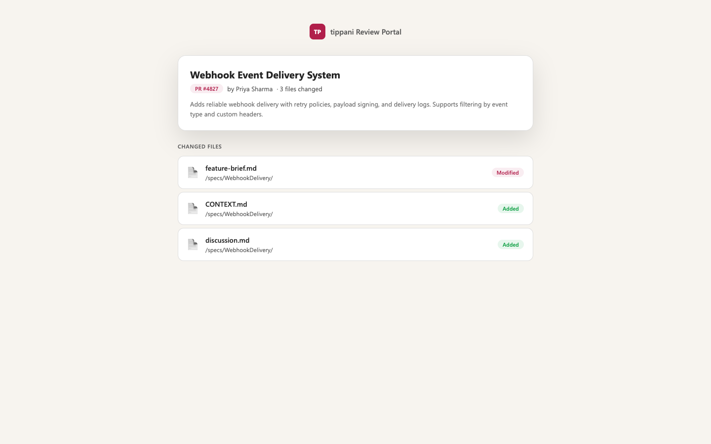
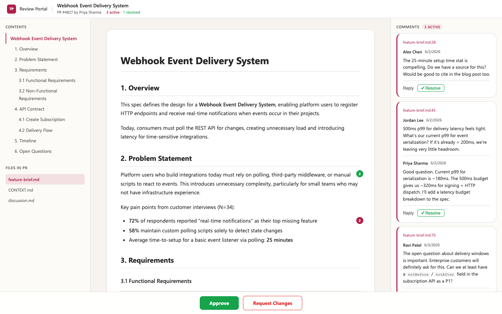

# tippani

[](https://www.npmjs.com/package/tippani)
[](https://github.com/mavaali/tippani/releases/latest)
[](LICENSE)

> टिप्पणी — *annotation* (Sanskrit)

**A code diff is the wrong surface for reviewing prose.**

When your specs live in git — PRDs, design docs, RFCs, ADRs — the people who most need to read them are the ones least equipped to. Tippani renders those markdown files as documents: a table of contents, real headings, working Mermaid diagrams, and a comment you drop by hovering a paragraph. It's a three-column reading workspace that happens to be wired to a pull request, so comments post to real threads and edits commit to the real branch.

Offline-capable, local-first, and drivable by an AI agent you watch work.

## Try it — no setup

```bash
npx tippani --demo
```

Opens the portal on a sample spec with sample comment threads. No Azure DevOps, no login, no clone. Nothing is sent anywhere.

## Quick Start

Install globally from npm:

```bash
npm install -g tippani
tippani 12345 --org=https://dev.azure.com/YOUR_ORG --project="Your Project" --save-config
```

Or run without installing:

```bash
npx tippani 12345 --org=https://dev.azure.com/YOUR_ORG --project="Your Project" --save-config
```

Or download a standalone binary from the [latest release](https://github.com/mavaali/tippani/releases/latest):

| Platform | Download | Requires |
|---|---|---|
| **macOS** (Apple Silicon) | [`tippani`](https://github.com/mavaali/tippani/releases/latest/download/tippani) | Nothing — standalone binary |
| **Windows** | [`cli.cjs`](https://github.com/mavaali/tippani/releases/latest/download/cli.cjs) + [`tippani.bat`](https://github.com/mavaali/tippani/releases/latest/download/tippani.bat) | Node.js 18+ |
| **Linux / macOS** | [`cli.cjs`](https://github.com/mavaali/tippani/releases/latest/download/cli.cjs) + [`tippani.sh`](https://github.com/mavaali/tippani/releases/latest/download/tippani.sh) | Node.js 18+ |

## Screenshots

**File Picker** — select which file to review from a multi-file PR:



**Spec View** — three-column layout with TOC, rendered markdown, and comment threads:



## Features

- **File picker** — multi-file PRs show a landing page; single-file PRs auto-open
- **Three-column layout** — TOC sidebar, rendered spec, comment threads (all resizable)
- **Inline commenting** — hover any content block → click `+` → comment posts to ADO
- **WYSIWYG editing** — edit the spec in place and commit back to the PR branch
- **Offline mode** — cache PR data, comment offline, sync when reconnected
- **Local review, no PR** — point at a git clone and review a spec on any branch, with no pull request and no Azure DevOps at all
- **Private annotations** — personal, line-anchored notes on a draft spec that stay on your machine and survive edits to the document
- **Dark mode** — auto-detects system preference
- **Active/resolved threads** — color-coded with inline bubbles on spec content
- **Review actions** — Approve / Request Changes from the bottom bar, recorded as your vote on the PR

## Usage

```bash
# Try it on a sample spec — no ADO, no config
npx tippani --demo

# Open a PR for review (uses saved config)
npx tippani <PR_ID>

# Open a specific file directly
npx tippani <PR_ID> --file="/path/to/spec.md"

# Work offline (must have run online at least once for this PR)
npx tippani <PR_ID> --offline

# Force re-fetch from ADO
npx tippani <PR_ID> --refresh

# Review a local git clone — no PR needed
npx tippani --local-repo=/path/to/clone
```

## Configuration

Settings are stored in `~/.tippani/config.json`:

```json
{
  "org": "https://dev.azure.com/myorg",
  "project": "My Project",
  "repo": "My Repo"
}
```

You can also use environment variables:
- `TIPPANI_ORG`
- `TIPPANI_PROJECT`
- `TIPPANI_REPO`

Priority: CLI flags > env vars > config file.

## Authentication

The CLI authenticates to Azure DevOps in this order:

1. **Saved PAT** — stored at `~/.tippani/pat` (only if you created one previously)
2. **Azure CLI** — `az account get-access-token` (recommended: just run `az login` once — no PAT needed)
3. **Interactive prompt** — falls back to asking for a PAT only if neither of the above is available

**You do not need a PAT.** If `az` is installed and you've run `az login`, tippani authenticates automatically and never prompts. This is the recommended path — in many tenants, PAT creation is disabled by policy.

If you can't use `az login`, generate a PAT at `https://dev.azure.com/YOUR_ORG/_usersSettings/tokens` with **Code (Read & Write)** scope.

## Offline Mode

```bash
# First run caches everything
npx tippani 12345

# Later, work offline — no ADO connection needed
npx tippani 12345 --offline

# Comments are queued locally
# When back online, sync to ADO:
npx tippani 12345   # click "Sync to ADO" in the status bar
```

Cache is stored at `~/.tippani/cache/` and is valid for 1 hour.

## Build Standalone Binary

```bash
npm run build
```

Produces:
- `dist/bin/tippani` — macOS standalone (68MB, no Node.js required)
- `dist/cli.cjs` + `dist/tippani.bat` — Windows (requires Node.js 18+)
- `dist/tippani.sh` — Linux/macOS shell wrapper

To build a Windows `.exe`, run `npm run build` on a Windows machine with Node.js 20+.

## Architecture

CLI (`src/index.js`) that:
1. Authenticates to ADO via `az cli` or PAT — or skips ADO entirely for local-clone review
2. Fetches PR metadata, changed files, file contents, comment threads
3. Caches everything locally for offline use
4. Starts a local Express server on port 3847
5. Renders markdown to HTML via `remark` + `rehype`
6. Opens the browser to Tippani

Comments are written to a local queue first, then synced to ADO. If offline, they stay in the queue until the next sync. Review votes are the exception — they are never queued, since a stale vote synced later could approve a PR whose content has moved on.

`src/demo.js` serves the same portal over fixture data for `--demo`. It shares the design system and helpers with the real portal so the demo can't drift from what ships.

## AI / MCP integration

Tippani exposes a [Model Context Protocol](https://modelcontextprotocol.io) server so LLM clients (Claude Desktop, GitHub Copilot, etc.) can drive the review workflow — open a PR, triage threads, stage replies and whole-file spec edits, resolve or mark threads viewed — while you watch in tippani's browser UI and approve each action. The design is tracked in issue [#42](https://github.com/mavaali/tippani/issues/42).

**Self-bootstrapping — you don't start tippani first.** The shim launches (or adopts) a review portal per PR on demand via the `open_pr` tool, opening a visible browser window for you while the agent drives it. Multiple PRs can run at once on separate ports, discovered across processes via a per-port registry under `~/.tippani/instances/`.

**Setup (Claude Desktop):** install tippani globally (`npm i -g tippani`), then add to your `claude_desktop_config.json`. For Azure DevOps work, pass an ADO REST/git access token via `TIPPANI_ADO_TOKEN`; without one the shim still starts in local-only mode (local-clone review works, and the ADO tools ask for a token if used). Optionally set `TIPPANI_ADO_AUDIENCE` to have it verify the token's audience on startup:

```json
{
  "mcpServers": {
    "tippani": {
      "command": "tippani-mcp",
      "env": { "TIPPANI_ADO_TOKEN": "<your ADO access token>" }
    }
  }
}
```

**Tools (40):**

- **Portal & navigation** — `open_pr` (call first), `open_file`, `open_thread`, `show_feedback` (cross-PR triage page), `set_view`, `set_feedback_filter`, `refresh_spec`.
- **Reading** — `list_threads`, `get_thread`, `get_spec`, `get_spec_draft`, `triage_summary`; focus with `focus_thread`.
- **Stage-then-review** — stage locally with `stage_draft`, `stage_spec_edit`, `stage_resolve_thread`; nothing reaches Azure DevOps until you finalize with `post_reply`, `commit_spec`, or `resolve_thread`. `commit_spec` requires explicit content — a staged proposal is review-only and never committed implicitly, so it can't overwrite your own edits. Also `edit_spec` (surgical anchored edits), `clear_draft`, `clear_spec_edit`, and `mark_viewed` (acknowledge a thread without resolving it).
- **Discovery** — `list_prs`, `search_specs`, `search_work_items`, `get_file_commits`.
- **Local review (no PR, no ADO)** — `open_branch`, `open_branch_file`.
- **Private annotations** — `read_personal_comments`, `add_personal_comment`, `edit_personal_comment`, `delete_personal_comment`, `reply_personal_comment`, `resolve_personal_comment`, plus navigation and bulk-cleanup tools.

Staged whole-file edits show up in the portal as a GitHub-style Current/Proposed diff you can accept-and-refine in the editor before committing.

The portal can also run standalone with `--headless` (agent-only, no browser), `--port=<n>` (run several at once), and `--ado-token=<t>` (bearer auth, skipping the PAT / az CLI). The underlying HTTP control API is directly usable for scripts and IDE extensions — see `src/control-api.js`.

## License

MIT — see [LICENSE](LICENSE)

## Changelog

See [CHANGELOG.md](CHANGELOG.md) for release history.
