# Tippani User Guide

A screen-by-screen tour of the Tippani portal: how to **discover**, **read**,
**annotate**, **edit**, and **author** the Markdown specs in your Git
repositories — without ever touching a raw diff.

All screenshots use placeholder *lorem ipsum* content in a throwaway sandbox.
Your own repositories and specs will appear in their place.

## Contents

- [Launching the portal](#launching-the-portal)
- [Discovery — the home screen](#discovery--the-home-screen)
  - [Specs](#specs-tab)
  - [Review queue](#review-queue-tab)
  - [Work items](#work-items-tab)
  - [Branches](#branches-tab)
  - [Reading list](#reading-list-tab)
- [Reviewing a spec](#reviewing-a-spec)
- [The comments panel](#the-comments-panel)
- [The Feedback screen](#the-feedback-screen)
- [Changed files: Current / Diff / Proposed](#changed-files-current--diff--proposed)
- [Reading a finished spec](#reading-a-finished-spec)
- [Authoring: branches, specs, and PRs](#authoring-branches-specs-and-prs)
- [Publishing and the staged-changes ticker](#publishing-and-the-staged-changes-ticker)

---

## Launching the portal

Point Tippani at your repositories once (this is the one place the connection
details matter), then open the Discovery portal:

```bash
tippani --org=https://dev.azure.com/YOUR_ORG --project="Your Project" --save-config
tippani --browse
```

The portal serves from `http://localhost:3847` by default (override with
`--port`). Everything runs locally — Tippani connects to your repositories on
your behalf and renders the UI in your browser.

The top bar is consistent everywhere: a **breadcrumb** on the left (`Home ›
…`) and the Tippani wordmark with the current mode (`· discovery`, `· read ·
annotate · edit`, `· feedback`) on the right.

---

## Discovery — the home screen

Discovery answers "what should I work on?" It has five tabs:

**Specs** · **Review queue** · **Work items** · **Branches** · **Reading list**

### Specs tab

Full-text search across the `.md` specs in your repositories. Type a keyword and
press **Search**; results are specs from each repository's default branch.

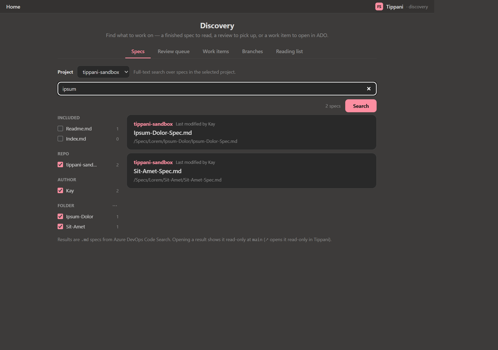

- The left rail narrows results by **Included** file name (e.g. `Readme.md`),
  **Repo**, **Author**, and **Folder**.
- Each result shows the repo, "Last modified by", the file name, and its path.
- Opening a result shows it **read-only at `main`**; the ↗ affordance opens it
  read-only inside Tippani (see [Reading a finished spec](#reading-a-finished-spec)).

> Newly pushed specs appear here once search has indexed them, which can lag a
> few minutes behind a commit.

### Review queue tab

Every pull request you can act on, as cards.

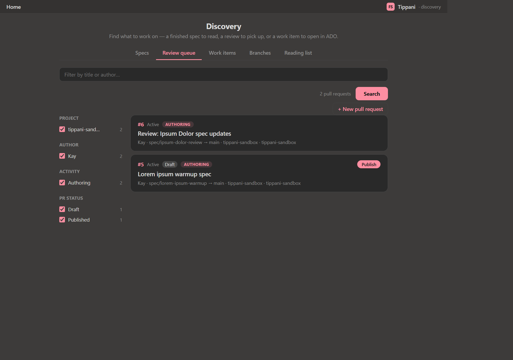

- A **filter box** ("Filter by title or author…") and a count ("N pull
  requests") sit at the top, next to **Search** and **+ New pull request**.
- The left rail filters by **Project**, **Author**, **Activity**, and **PR
  Status** (**Draft** / **Published**), each with a live count.
- Each card shows the **PR number**, its state badges (**Active**, **Draft**,
  **Authoring**), the **title**, and the `author · source → target · project ·
  repo` line. Click a card to open the PR for review.
- A **draft** PR's card carries a **Publish** button that stages a
  draft‑to‑published promotion (applied at the next push — see
  [Publishing](#publishing-and-the-staged-changes-ticker)).

**+ New pull request** expands an inline form to stage a PR — see
[Authoring](#authoring-branches-specs-and-prs).

### Work items tab

Look up the work items your specs relate to. Results open in your work tracker.

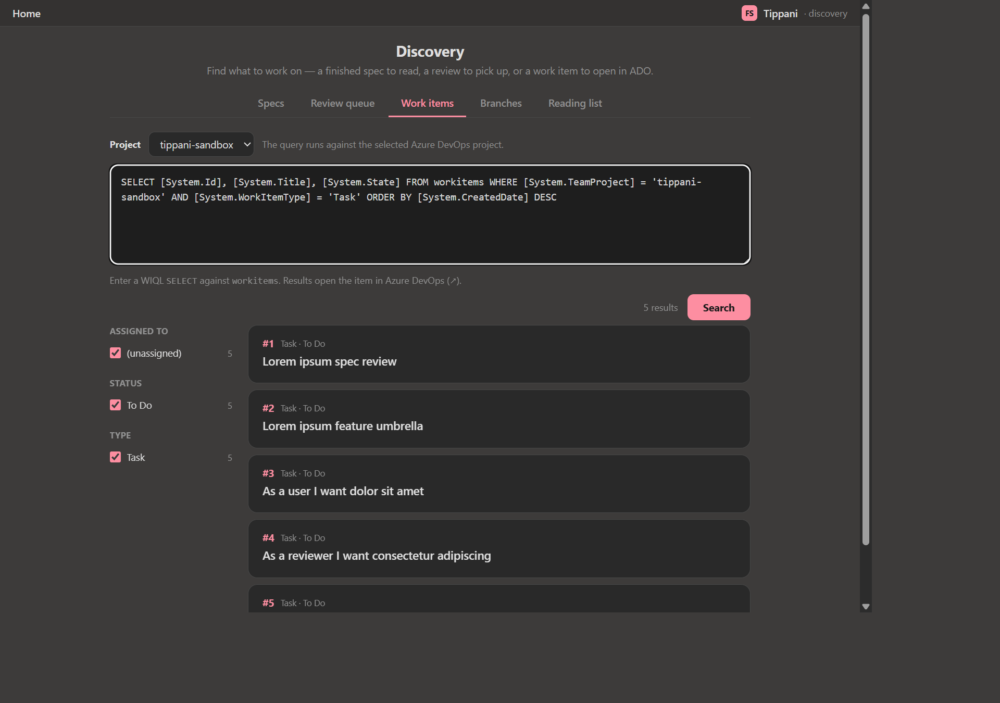

- The text area holds a query for the items you want. Edit it and press
  **Search**.
- Results show a count and a left rail faceted by **Assigned To**, **Status**,
  and **Type**.
- Each row shows the **id**, **type · state**, and **title**, and links out to
  the work item (↗).

### Branches tab

Your branches across the repos in the selected project.

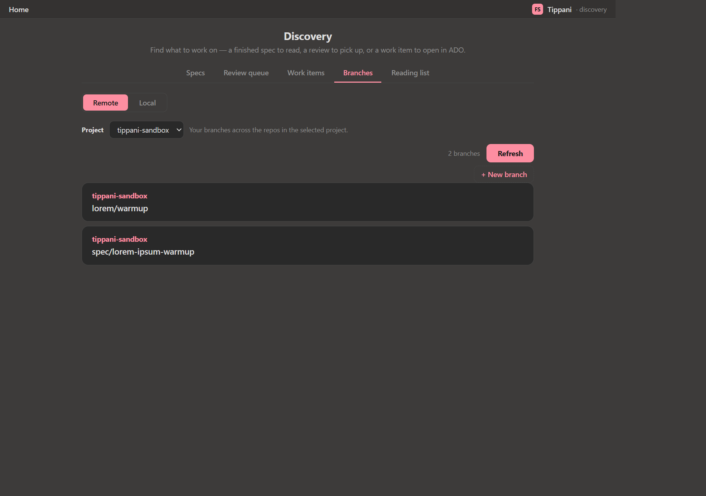

- A **Remote / Local** toggle switches between remote branches and branches in
  a local clone on disk.
- **Project** selector, a branch count, and **Refresh**.
- **+ New branch** stages a branch creation (part of the authoring flow).
- Each branch card links to the branch's file list, where you can open specs
  read-only or start editing.

### Reading list tab

A personal, persistent list of local `.md` files to open read-only, plus a
pinned link to this manual.

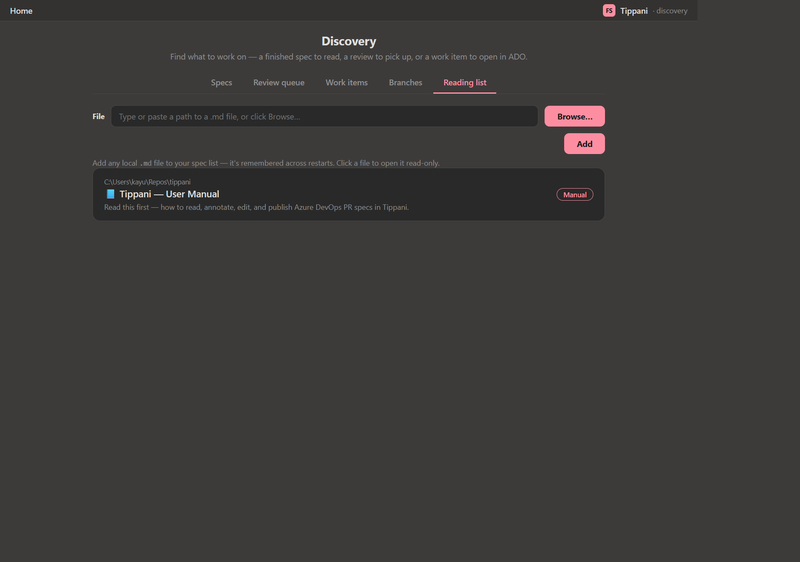

- Type or **Browse…** to a `.md` path and press **Add**; the entry is
  remembered across restarts. Each entry has a 🗑 control to remove it.
- The **Tippani — User Manual** entry is **pinned** ("Manual" badge) and always
  present at the bottom.
- Click any entry to open the file read-only in the reviewing view.

---

## Reviewing a spec

Opening a PR (from the Review queue, or with `tippani <PR_ID>`) lands on the
PR overview: the title, `PR #n by <author> · N file changed`, the description,
a **Feedback** card (open-thread count), and a **Changed Files** list.

Opening a changed file gives the three-pane reviewing workspace:

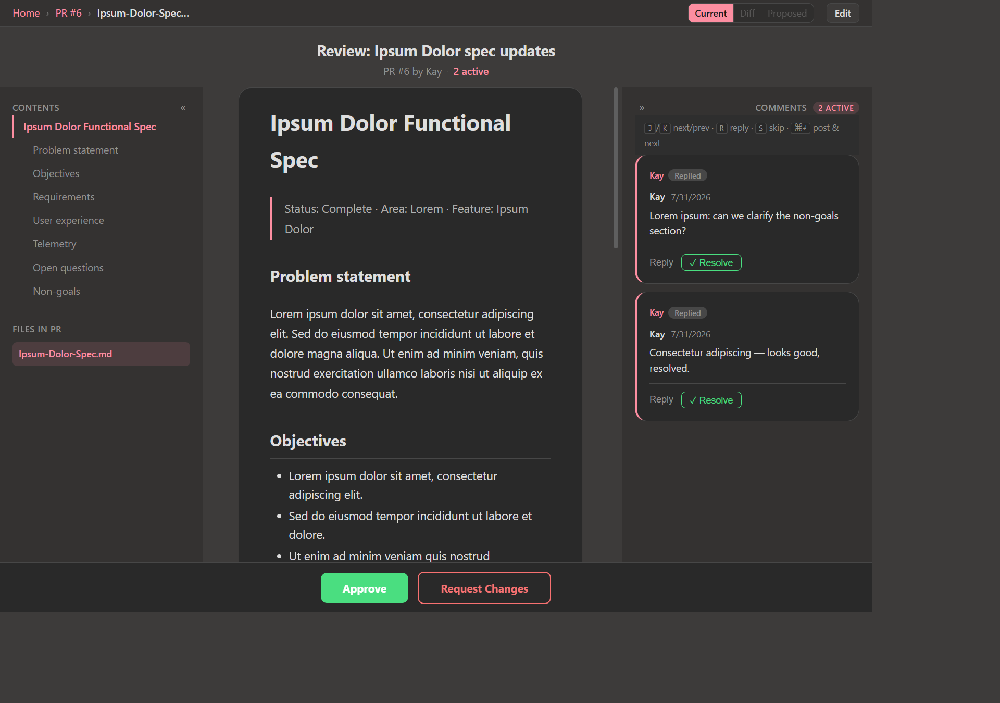

1. **Contents rail** (left) — the spec's headings as a jump list, plus **Files
   in PR**. Collapse it with `«`.
2. **Rendered spec** (center) — the Markdown for the selected view. A row of
   view tabs sits in the top bar: **Current**, **Diff**, **Proposed**, **Edit**.
3. **Comments panel** (right) — the review threads for this file, with a live
   **N ACTIVE** count.

A sticky action bar at the bottom offers **Approve** and **Request Changes**.

---

## The comments panel

The right-hand panel is built for fast, keyboard-driven review:

- Each thread shows the author, a **Replied** badge when applicable, the comment
  text, and **Reply** + **✓ Resolve** controls.
- Keyboard shortcuts are shown inline: `J` / `K` move to the next / previous
  comment, `R` replies, `S` skips, and `⌘⏎` posts and moves to the next.
- Replies and resolutions are **staged** locally; nothing leaves your machine
  until you push.

### Annotations

Beyond the shared review threads, Tippani supports **annotations** —
private notes pinned to a specific line of the open spec. They stay on your
machine, follow the text as it's edited, and are never sent to the host. They're
ideal for a first read-through before you leave formal review feedback.

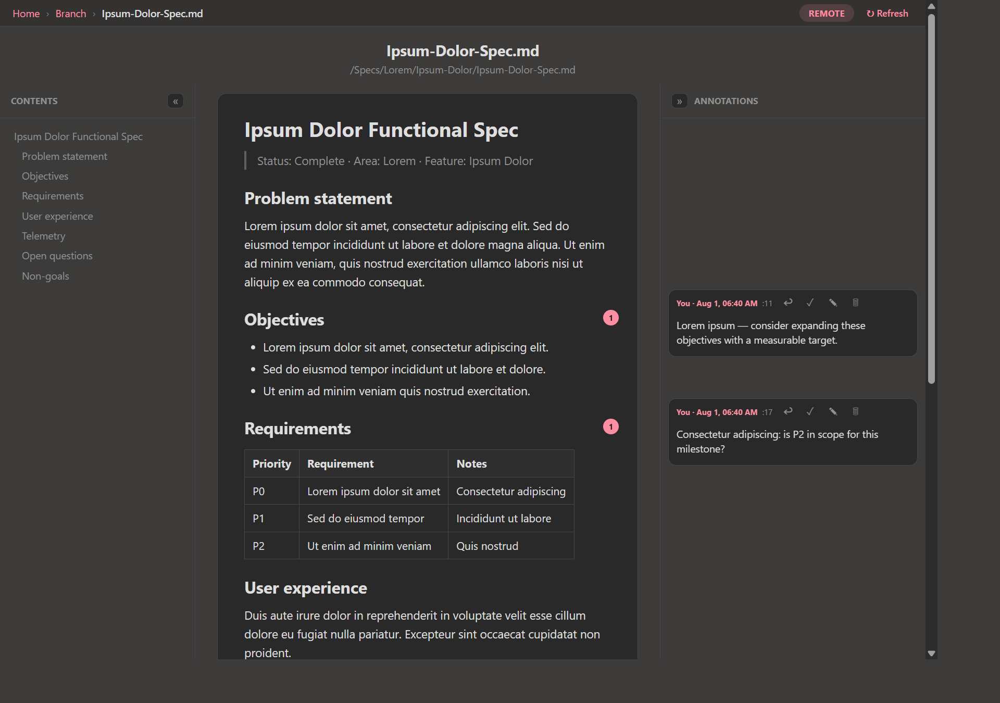

- The **Annotations** rail on the right lists every note on the open file, each
  stamped with the author, date, and the line it's pinned to.
- A small count badge appears next to any heading whose section carries
  annotations, so you can see at a glance where your notes are.
- Each note has controls to reply, resolve, edit, and delete it.

---

## The Feedback screen

The **Feedback** card on a PR (or the `· feedback` mode) opens a consolidated
view of every thread on the PR.

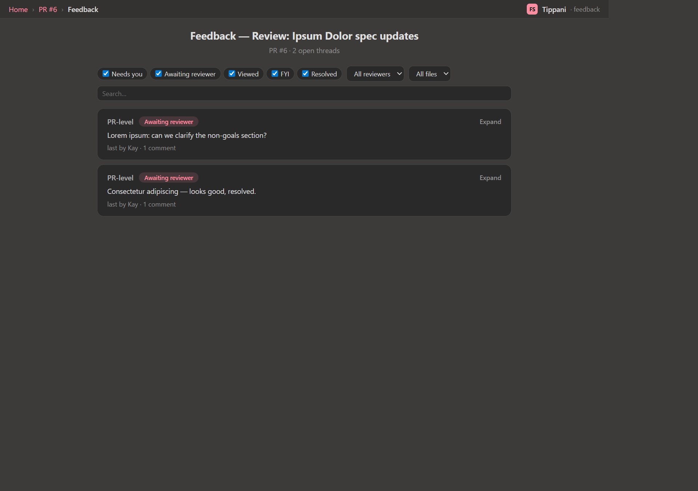

- Filter chips across the top: **Needs you**, **Awaiting reviewer**, **Viewed**,
  **FYI**, and **Resolved**.
- Dropdowns to scope by **reviewer** and **file**, plus a search box.
- Each thread card shows its scope (e.g. **PR-level**), its state (e.g.
  **Awaiting reviewer**), the latest comment, "last by … · N comment", and an
  **Expand** control to read and reply to the full thread.

---

## Changed files: Current / Diff / Proposed

Every changed file in a PR can be viewed three ways from the top-bar tabs:


- **Current** — the file as it is on the PR branch, rendered cleanly.
- **Diff** — additions and removals inline (added lines are marked `+`).
- **Proposed** — the file as it would read after any staged edits are applied.
- **Edit** — opens the WYSIWYG editor to change the spec in place; edits are
  staged, not written directly.

The **Edit** view is a rich Markdown editor with a formatting toolbar (bold,
italic, lists, tables, blockquotes, code, links, and images), while the
**Comments** rail and review controls stay alongside:

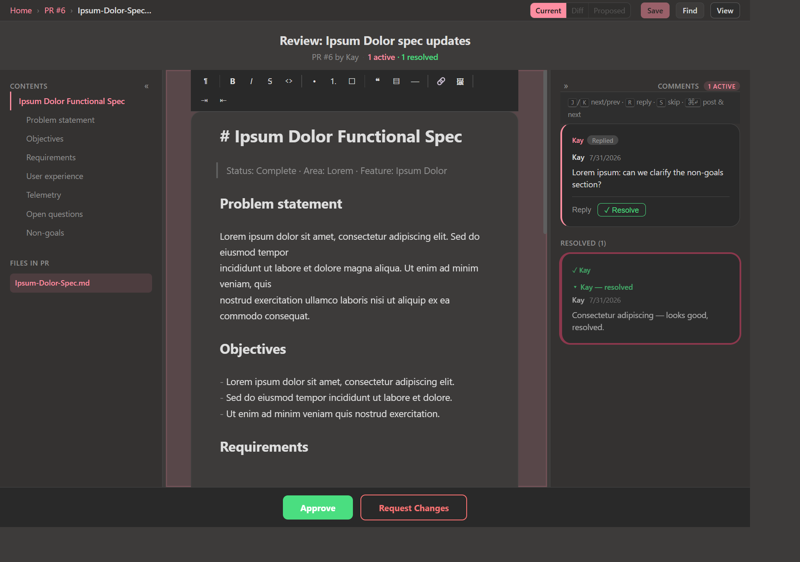

The **Contents** rail and the per-file **Comments** count stay in sync as you
switch views and files.

---

## Reading a finished spec

Opening a spec from the **Specs** tab (or the Reading list) shows it read-only
at `main` — the same rendered view, without the PR review chrome:

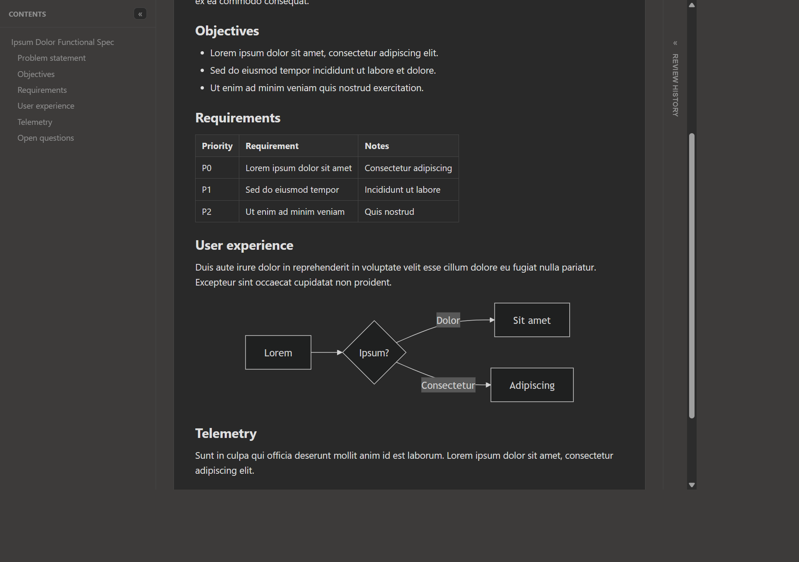

- A **Contents** rail mirrors the spec's headings.
- The body renders Markdown fully: headings, blockquotes, lists, **tables**,
  code, images, and **Mermaid** diagrams.
- A **Review History** panel is available on the right, and **↻ Refresh**
  reloads the file from source.

---

## Authoring: branches, specs, and PRs

Tippani can create brand-new specs and PRs with **no local clone**. Everything
is **staged** first and published together. The flow:

1. **Stage a branch.** From the **Branches** tab, **+ New branch** (or the
   authoring tools) stages a branch creation from a base branch. Nothing is
   created on the host yet.
2. **Add or edit `.md` files.** Add new folders and Markdown files, or edit
   existing ones, on the staged branch. New and edited files use the same
   Current / Diff / Proposed reading views as PR-bound proposals.
3. **Stage a pull request.** From the **Review queue**, **+ New pull request**
   opens a form to stage a PR:

   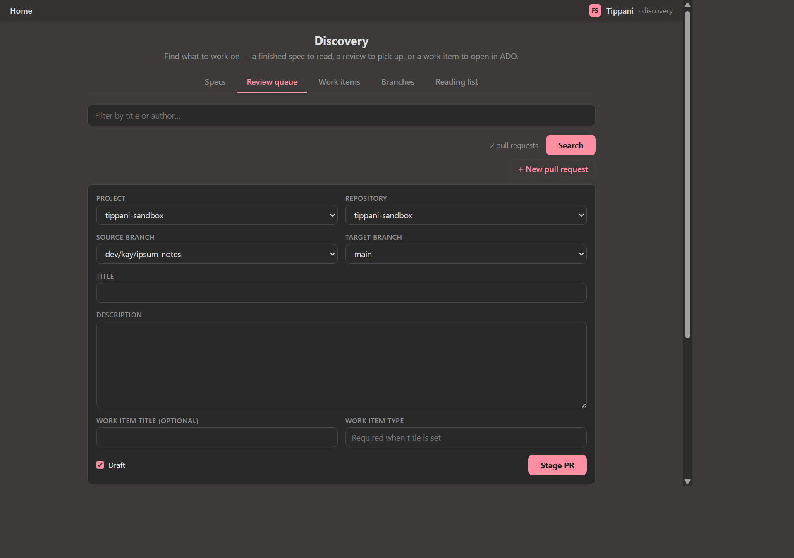

   Pick **Project**, **Repository**, **Source branch**, and **Target branch**;
   fill in **Title** and **Description**; optionally set a **Work item title**
   and **Work item type** to link a Spec-review item; toggle **Draft**; and press
   **Stage PR**. The PR is created only when you push.
4. **Push.** One action publishes the entire staged set (see below).

Existing remote files carry their load-time branch tip, so if the branch moves
underneath you, publication is rejected rather than silently overwriting newer
work.

---

## Publishing and the staged-changes ticker

Every staged change — review replies, resolutions, new/edited files, staged PRs,
and draft→published promotions — is collected into one pending set. A top-row
**staged-changes ticker** ("You have N staged changes · Push to remote") appears
across the Branches and Review-queue surfaces whenever anything is pending.

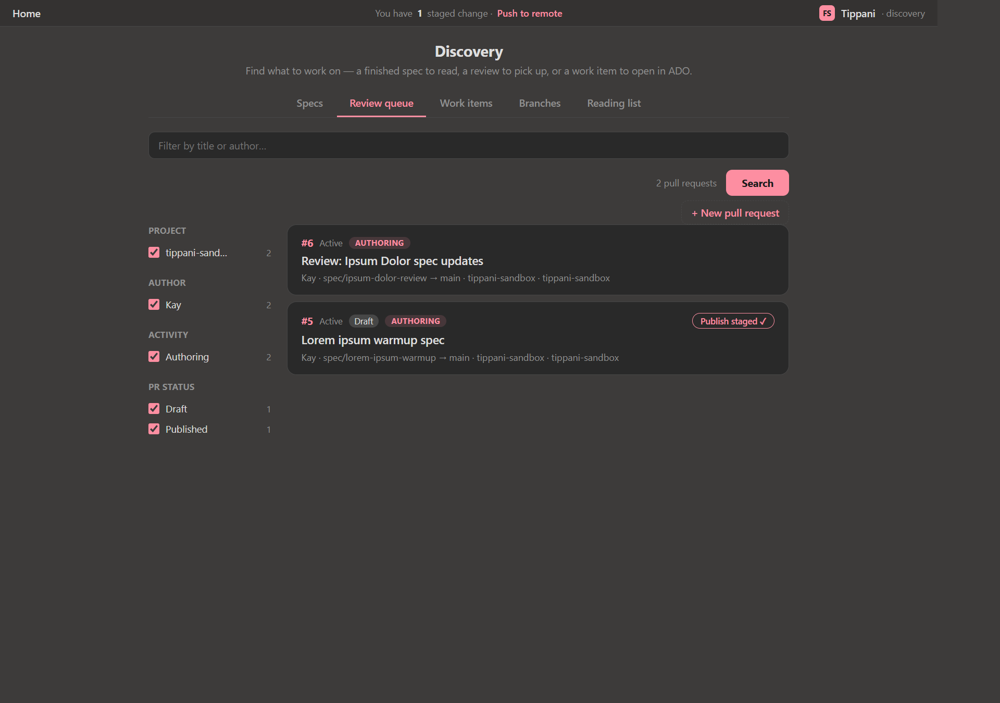

Pressing **Push to remote** (or the MCP `push_staged_changes` tool) is the single
moment anything is sent to the host. In order, it:

1. flushes staged review replies and resolutions;
2. creates any staged branches and publishes staged file adds/edits (grouped by
   repository and branch, one commit per group);
3. creates staged PRs and optional work-item links; and
4. applies staged **draft → published** PR promotions.

Anything that succeeds is cleared from the staged set; a group that fails keeps
its staged state with a target-specific error so you can fix and retry. A staged
PR card also carries a **delete** control to discard the intent before it's ever
pushed.

That's the whole loop: **discover → read → annotate → edit → author → push.**
For the programmatic equivalent, see the [MCP & API Reference](mcp-api.md).
